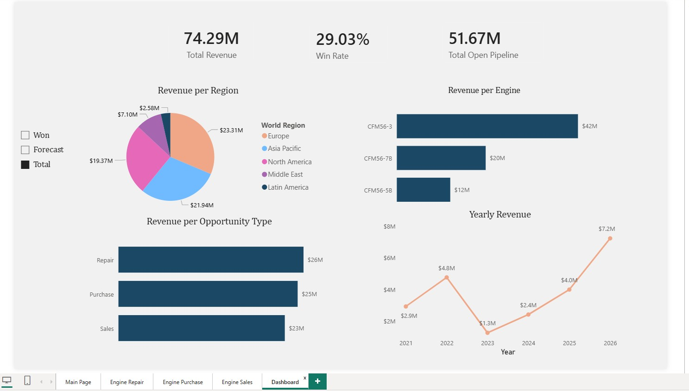

# Data-Migration-And-Sales-Dashboard

Sales data migration from Salesforce to ERP (mock data, based on a real project) — includes Python/SQL migration scripts and a Power BI executive dashboard.

## The Problem

The company wanted to have all their data in one place. They chose to migrate Salesforce data into their existing ERP system. That meant ~800 records across Accounts, Contacts, and Opportunities needed to move over cleanly, with all the reporting and dashboards the sales team relied on rebuilt from scratch on the new platform.

## My Role & Process

**1. Field Mapping**
Mapped and defined every field between Salesforce and the ERP's data model, identifying where structures, naming conventions, and field-length constraints differed between the two systems.

**2. Data Extraction & Cleaning**
Extracted the full dataset from Salesforce (~800 records) and used Python to clean and reshape it to fit ERP constraints — including reducing text/company name lengths to match ERP field limits and standardizing formatting across records.

**3. Migration Execution**
Migrated the cleaned data using a combination of:
- The ERP's internal migration/import tool
- Custom **UPDATE SQL query bundles**, generated with Python, for records and fields the internal tool couldn't handle cleanly

Migration was run in a specific dependency order to preserve relational integrity:
1. **Company** (Accounts)
2. **Contacts**
3. **Opportunities**

**4. Reporting Layer — Views**
Once data landed in the ERP, built SQL **views** on top of the raw tables so each entity (Accounts, Contacts, Opportunities, Addresses) could be pulled cleanly as its own structured table — creating a stable, query-friendly foundation for downstream reporting tools instead of exposing raw ERP tables directly.

**5. Power BI Dashboard**
Built a multi-page Power BI dashboard on top of those views:
- Three operational pages (**Engine Repair**, **Engine Purchase**, **Engine Sales**) mirroring what reps used to see in Salesforce — opportunity tables, milestone/status trackers, and pipeline stage tracking
- One executive **Dashboard** page for sales leadership: Total Revenue, Win Rate, Total Open Pipeline, and an interactive **Won / Forecast / Total** toggle that dynamically re-shapes every chart (region, engine type, opportunity type, and revenue trend) between actuals and forecasted pipeline

**6. Crystal Reports**
Built supporting Crystal Reports for sales leadership covering active opportunities per rep and pipeline status, for teams that needed a printable/scheduled report format rather than an interactive dashboard.

## Key Technical Highlights (Power BI Layer)

- **Disconnected "Revenue View" table + `SELECTEDVALUE`/`SWITCH` pattern** powering the Won/Forecast/Total toggle, letting one slicer dynamically re-shape every measure on the executive page without duplicating visuals.
- **`KEEPFILTERS` filter-context fix** — resolved a `CALCULATE` filter-override bug where a clustered bar chart was showing the same repeated total for every category instead of distinct values per Opportunity Type.
- **Dynamic, self-adjusting stage-ordering logic** — each of the three pipelines (Repair, Purchase, Sales) has a different number of stages (7, 8, and 5 respectively). Built a `LOOKUPVALUE`-based `Stage Order` column and a bucketing measure that reads each pipeline's max stage count dynamically via `CALCULATE(MAX(...))`, rather than hardcoding stage counts that would break if a pipeline's stage list changed.
- **Diagnosed a circular dependency** between a text bucket-label column and its numeric sort-order column — a common but under-documented DAX pitfall when implementing custom `Sort by Column` logic.
- **Verified every calculated figure against source data** — cross-checked region, engine type, and opportunity-type breakdowns across all three (Won/Forecast/Total) states to confirm 100% accuracy before rollout.

## Results & Business Impact

- **Centralized, accurate forecasting** — with all opportunity data now living in one system, the company could track the full lifecycle of a deal — from Negotiation through Closed Won — and tie it to actual revenue recognition once a repair was invoiced in the ERP. This closed a visibility gap that previously existed between Salesforce's pipeline data and the ERP's financial/invoicing data, giving leadership a single, trustworthy source for forecasted vs. realized revenue.
- **~$10,000 in annual savings** from retiring Salesforce licensing, since sales reporting and pipeline tracking were fully replicated (and improved) within the ERP and Power BI at no additional licensing cost.

## Tools & Technologies

Salesforce · ERP (data migration & SQL views) · Python (data cleaning, SQL bundle generation) · SQL · Power BI Desktop · DAX · Power Query (M) · Crystal Reports

## Screenshots

**Main Page**

**Engine Sales Page**

**Engine Purchase Page**

**Engine Repair Page**

**Executive Dashboard**

---

*This repo contains a data migration project built with mock data, based on a real project where I migrated sales data from Salesforce to an ERP system. Company names, figures, and records shown here are fictional and do not represent any real company's data.*
